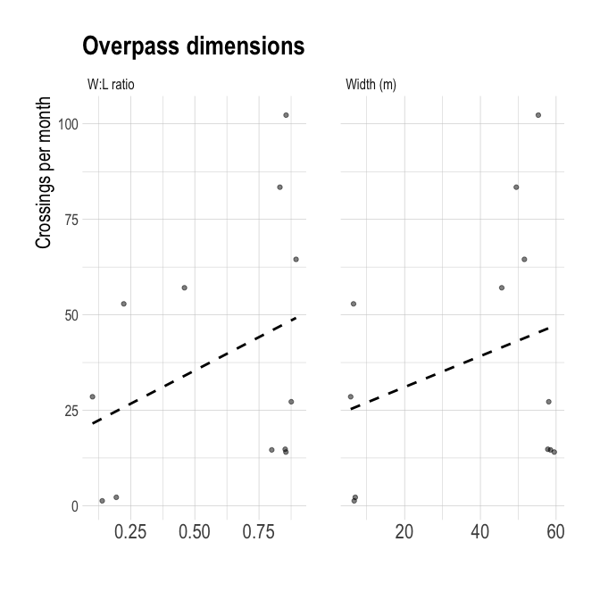

Wildlife Overpass Review
================
Clayton Lamb, Liam Brennan, Emily Chow
25 February, 2022

## Load Data

``` r
library(here)
library(tidyverse)
library(sf)
library(readxl)
library(lubridate)
library(mapview)
library(ggmap)
library(raster)
library(stars)
library(velox)
library(hrbrthemes)
library(RColorBrewer)
library(knitr)
library(basemaps)
library(rworldmap)
library(RStoolbox)
library(ggpubr)
library(cowplot)
library(tidylog)
options(scipen=999)

##load data
df <- read_xlsx(here::here("data","2022-02-19-Crossing Structure Literature Review Data_Figures.xlsx"))
eff <- read_xlsx(here::here("data","2022-02-19-Crossing Structure Literature Review Data_Figures.xlsx"), sheet="CL_eff")
```

## Map

``` r
##make spatial, keep last check
op <- st_as_sf(df%>%mutate(Lat=extract_numeric(Lat),
                                                Long=extract_numeric(Long)),
               coords=c("Long", "Lat"),
               crs=4326)%>%
    mutate(Continent=case_when(Country%in%c("U.S.A", "Canada","U.S.A.")~"North America",
                             TRUE~"Europe, Asia, and Oceania"))%>%
  rename(`Width (m)`=`Estimated inner Width (m) ( from Google Earth)(in cases where fencing is visible - inner fence/rail where visible)`,
         `Length (m)`=`Estimated Length (m) ( Headwall)(end to end of physical structure, often indicated by start and stop of guard rail / concreate/metail edge of strcuture)`,
         lanes=`Number of lanes spanned`,
         year=`Year of build_clean`)%>%
  mutate(`Length (m)`=as.numeric(`Length (m)`),
         `Width (m)`=as.numeric(`Width (m)`),
         lanes=as.numeric(lanes))

               
mapview(op)

world_sf <- st_as_sf(getMap(resolution = "low"))%>%
  st_transform_proj(world_sf, crs = "+proj=wintri")

grat_wintri <- 
  st_graticule(lat = c(-89.9, seq(-80, 80, 20), 89.9)) %>%
  st_transform_proj(crs = "+proj=wintri")

# vectors of latitudes and longitudes that go once around the 
# globe in 1-degree steps
lats <- c(90:-90, -90:90, 90)
longs <- c(rep(c(180, -180), each = 181), 180)

# turn into correctly projected sf collection
wintri_outline <- 
  list(cbind(longs, lats)) %>%
  st_polygon() %>%
  st_sfc( # create sf geometry list column
    crs = "+proj=longlat +ellps=WGS84 +datum=WGS84 +no_defs"
  ) %>% 
  st_sf() %>%
  st_transform_proj(crs = "+proj=wintri") # transform to Winkel tripel


ggplot() + 
  geom_sf(data = wintri_outline, fill = "#56B4E950", color = NA) +
  geom_sf(data = grat_wintri, color = "gray10", size = 0.25/.pt, alpha=0.5) + 
  geom_sf(data = world_sf, color = "gray60", size = 0.5/.pt) +
  geom_sf(data = wintri_outline, fill = NA, color = "grey30", size = 0.5/.pt, alpha=0.5) +
  geom_sf(data=op%>%
  st_transform_proj(crs = "+proj=wintri"), size = 2/.pt, color="red")+
  coord_sf(datum = NULL)+
  theme_map()
```

<!-- -->

``` r
#prep basemap
register_google("xAIzaSyCOwGx2D77XOqRgGhKmcb5F4Kt_S61tCLIx")
set_defaults(map_service = "osm", map_type = "terrain_bg")

##GLOBAL
bb = st_bbox(c(xmin = -185, xmax = 185, ymax = 85, ymin = -85), crs = st_crs(4326))

bb_ll = st_bbox(
  st_transform(
    st_as_sfc(bb), 
    3857
  )
)
a <- basemap_raster(bb_ll)

a <- a%>%projectRaster(crs="+proj=wintri")
writeRaster(a,here::here("data","basemap.tif"), overwrite=TRUE)
a <- brick(here::here("data","basemap.tif"))%>%
  mask(wintri_outline)

world <- getMap(resolution = "high")
world <- st_as_sf(world)

world <-ggRGB(a, r=1, g=2, b=3)+
  geom_sf(data=op%>%
  st_transform_proj(crs = "+proj=wintri"), size = 2/.pt, color="red")+
  coord_sf(datum = NULL)+
  theme_map()

##W-NA
bb = st_bbox(c(xmin = -137, xmax = -93, ymax = 55, ymin = 28), crs = st_crs(4326))

bb_ll = st_bbox(
  st_transform(
    st_as_sfc(bb), 
    3857
  )
)

bb_clip=st_bbox(c(xmin = -12.5E6, xmax = -10.3E6, ymin = 3.4E6, ymax = 6.4E6), crs = "+proj=wintri")

a <- basemap_raster(bb_ll)
a <- a%>%projectRaster(crs="+proj=wintri")%>%
  raster::crop(bb_clip%>%extent)
writeRaster(a,here::here("data","basemap.tif"), overwrite=TRUE)
a <- brick(here::here("data","basemap.tif"))%>%
  mask(wintri_outline)

WNA <- ggRGB(a, r=1, g=2, b=3)+
  geom_sf(data=op%>%filter(Continent=="North America")%>%st_transform_proj(crs = "+proj=wintri")%>%st_intersection(bb_clip%>%st_as_sfc),
          size = 5/.pt, color="red")+
  coord_sf(datum = "+proj=wintri")+
  theme_map()


##Europe
bb = st_bbox(c(xmin = 2, xmax = 24, ymax = 58, ymin = 43), crs = st_crs(4326))

bb_ll = st_bbox(
  st_transform(
    st_as_sfc(bb), 
    3857
  )
)

bb_clip=st_bbox(c(xmin = 0.2E6, xmax = 2.2E6, ymin = 4.4E6, ymax = 6.1E6), crs = "+proj=wintri")

a <- basemap_raster(bb_ll)
a <- a%>%projectRaster(crs="+proj=wintri")%>%
  raster::crop(bb_clip%>%extent)
writeRaster(a,here::here("data","basemap.tif"), overwrite=TRUE)
a <- brick(here::here("data","basemap.tif"))%>%
  mask(wintri_outline)

EU <- ggRGB(a, r=1, g=2, b=3)+
  geom_sf(data=op%>%filter(Continent!="North America")%>%st_transform_proj(crs = "+proj=wintri")%>%st_intersection(bb_clip%>%st_as_sfc),
          size = 5/.pt, color="red")+
  coord_sf(datum = "+proj=wintri")+
  theme_map()

mapview(op%>%filter(Continent!="North America")%>%st_transform_proj(crs = "+proj=wintri")%>%st_intersection(bb_clip%>%st_as_sfc))+mapview(bb_clip)

plot_grid(world,plot_grid(WNA, EU, labels = c("B","C"), rel_widths = c(1, 1.9)), labels = c("A",NA),nrow=2, rel_heights = c(1.9,1))
```

<!-- -->

``` r
ggsave(here::here("output","map.png"), height=7, width=7, unit="in", bg="white")
```

## Plots

``` r
##clean up column names
plot.dat <- op%>%
  tibble%>%
  dplyr::select(Continent,
                year,
                `Width (m)`,
                `Length (m)`,
                lanes)%>%
    mutate(`Width:length ratio`=`Width (m)`/`Length (m)`)%>%
  tidyr::pivot_longer(`Width (m)`:`Width:length ratio`)%>%
  mutate(name=fct_relevel(name,"Length (m)","Width (m)","Width:length ratio", "lanes"))

plot.dat%>%
  filter(!name%in%"lanes")%>%
  ggplot(aes(y=value))+
    geom_boxplot(fill="grey")+
    facet_wrap(vars(name), scales="free_y")+
  theme_ipsum()+
     theme(axis.title.x = element_text(size=17),
          axis.title.y = element_text(size=17),
          axis.text.x = element_blank(),
          axis.text.y = element_text(size=13),
          plot.title = element_text(size=22),
          plot.subtitle = element_text(size=17),
          legend.position = "none")+
  labs(title="Overpass dimensions",y="")
```

<!-- -->

``` r
ggsave(here::here("output", "op_dims.png"), height=6, width=7, unit="in",bg="white")

plot.dat%>%
    filter(!name%in%"lanes")%>%
  ggplot(aes(y=value, fill=name))+
    geom_boxplot()+
    facet_grid(name~Continent, scales="free_y")+
  theme_ipsum()+
     theme(axis.title.x = element_text(size=17),
          axis.title.y = element_text(size=17),
          axis.text.x = element_blank(),
          axis.text.y = element_text(size=13),
          plot.title = element_text(size=22),
          plot.subtitle = element_text(size=17),
          legend.position = "none")+
  labs(title="Overpass dimensions",y="")
```

<!-- -->

``` r
ggsave(here::here("output", "op_dims_continent.png"), height=10, width=7, unit="in",bg="white")


by.year <- plot.dat%>%
      filter(name%in%"Width (m)")%>%
drop_na(year)%>%
  ggplot(aes(y=value, x=`year`))+
  geom_point()+
  theme_ipsum()+
      facet_wrap(vars(Continent))+
     theme(axis.title.x = element_text(size=17),
          axis.title.y = element_text(size=17),
          axis.text = element_text(size=13),
          plot.title = element_text(size=22),
          plot.subtitle = element_text(size=17),
          legend.position = "none")+
  labs(title="Width through time",y="Width (m)", x="Year built")

plot.dat%>%
      filter(name%in%"Width (m)")%>%
      drop_na(year)%>%
  lm(value~year+ Continent, data=.)%>%
  summary

by.size <- op%>%
drop_na(ApproxSize)%>%
  mutate(ApproxSize=fct_relevel(ApproxSize,"Small (<50 lbs)","Medium (50-350 lbs)","Large (>350 lbs)"))%>%
  ggplot(aes(y=`Width (m)`, x=ApproxSize))+
    geom_boxplot(fill="grey")+
  theme_ipsum()+
     theme(axis.title.x = element_text(size=17),
          axis.title.y = element_text(size=17),
          axis.text = element_text(size=13),
          plot.title = element_text(size=22),
          plot.subtitle = element_text(size=17),
          legend.position = "none")+
  labs(title="Width varies by target species",y="Width (m)", x="Target species body size")

ggarrange(by.size,by.year, labels="AUTO", ncol=1)
```

<!-- -->

``` r
ggsave(here::here("output", "op_dims_bodysize_year.png"), height=10, width=7, unit="in",bg="white")

op%>%
drop_na(ApproxSize)%>%
  mutate(ApproxSize=fct_relevel(ApproxSize,"Small (<50 lbs)","Medium (50-350 lbs)","Large (>350 lbs)"))%>%
  lm(`Width (m)`~`ApproxSize`, data=.)%>%
  summary
```

## Summary stats

``` r
plot.dat%>%
  group_by(name) %>%
  summarise(mean = mean(value, na.rm = TRUE),
            min = min(value, na.rm = TRUE),
            max = max(value, na.rm = TRUE),
            n=n())%>%
  kable
```

| name               |       mean |        min |        max |  n |
| :----------------- | ---------: | ---------: | ---------: | -: |
| Length (m)         | 71.0987209 | 23.2200000 | 138.280000 | 92 |
| Width (m)          | 42.0809412 |  5.6000000 | 122.440000 | 92 |
| Width:length ratio |  0.6682694 |  0.0886497 |   2.761843 | 92 |
| lanes              |  4.2151899 |  0.0000000 |   9.000000 | 92 |

``` r
plot.dat%>%
  group_by(Continent, name) %>%
  summarise(mean = mean(value, na.rm = TRUE),
            min = min(value, na.rm = TRUE),
            max = max(value, na.rm = TRUE),
            n=n())%>%
  kable
```

| Continent                 | name               |       mean |        min |        max |  n |
| :------------------------ | :----------------- | ---------: | ---------: | ---------: | -: |
| Europe, Asia, and Oceania | Length (m)         | 74.0752381 | 23.2200000 | 138.280000 | 65 |
| Europe, Asia, and Oceania | Width (m)          | 46.0780645 | 10.6400000 | 122.440000 | 65 |
| Europe, Asia, and Oceania | Width:length ratio |  0.7218264 |  0.1354706 |   2.761843 | 65 |
| Europe, Asia, and Oceania | lanes              |  4.3620690 |  0.0000000 |   9.000000 | 65 |
| North America             | Length (m)         | 62.9456522 | 34.1500000 | 109.290000 | 27 |
| North America             | Width (m)          | 31.3060870 |  5.6000000 |  60.070000 | 27 |
| North America             | Width:length ratio |  0.5238982 |  0.0886497 |   1.101943 | 27 |
| North America             | lanes              |  3.8095238 |  2.0000000 |   8.000000 | 27 |

``` r
op%>%
  drop_na(year)%>%
  mutate(period=case_when(year<2010~"before",
                          year>=2010~"after"))%>%
  group_by(period) %>%
  summarise(W = mean(`Width (m)`, na.rm = TRUE),
            L=mean(`Length (m)`, na.rm = TRUE),
            n=n())%>%
  kable
```

| period |        W |        L |  n |
| :----- | -------: | -------: | -: |
| after  | 41.04158 | 62.73421 | 21 |
| before | 43.29647 | 65.90222 | 19 |

## Effectiveness

``` r
eff <- eff%>%
    rename(`Width (m)`=`Estimated inner Width (m) ( from Google Earth)(in cases where fencing is visible - inner fence/rail where visible)`,
         `Length (m)`=`Estimated Length (m) ( Headwall)(end to end of physical structure, often indicated by start and stop of guard rail / concreate/metail edge of strcuture)`,
         `W:L ratio`=`W:L ratio GE`)%>%
  mutate(`Length (m)`=as.numeric(`Length (m)`),
         `Width (m)`=as.numeric(`Width (m)`))
  
eff%>%
  dplyr::select(`Name (if applicable)`, Total, `Width (m)`,`W:L ratio`)%>%
  pivot_longer(`Width (m)`:`W:L ratio`)%>%
  ggplot(aes(y=Total, x=value, fill=name))+
    geom_point()+
    facet_wrap(vars(name), scales="free_x")+
  theme_ipsum()+
  geom_smooth(method="lm",se=FALSE)+
     theme(axis.title.x = element_text(size=17),
          axis.title.y = element_text(size=17),
          axis.text.x = element_text(size=17),
          axis.text.y = element_text(size=13),
          plot.title = element_text(size=22),
          plot.subtitle = element_text(size=17),
          legend.position = "none")+
  labs(title="Overpass dimensions",y="",x="")
```

<!-- -->

``` r
ggsave(here::here("output", "op_dims_effectiveness.png"), height=5, width=7, unit="in",bg="white")

library(tidymodels)
eff%>%
  dplyr::select(`Name (if applicable)`, Total, `Width (m)`,`W:L ratio`)%>%
  pivot_longer(`Width (m)`:`W:L ratio`)%>%
  nest(data = c(-name))%>% 
  mutate(
    fit = map(data, ~ lm(Total ~ value, data = .x)),
    tidied = map(fit, tidy)
  ) %>% 
  unnest(tidied) %>% 
  dplyr::select(-data, -fit)%>%
  filter(term=="value")%>%
  mutate_if(is.numeric, round, 5)%>%
  kable
```

| name      | term  | estimate | std.error | statistic | p.value |
| :-------- | :---- | -------: | --------: | --------: | ------: |
| Width (m) | value |  0.01856 |   0.01599 |   1.16083 | 0.28376 |
| W:L ratio | value |  0.92027 |   1.23944 |   0.74249 | 0.48195 |

``` r
eff%>%
  dplyr::select(`Name (if applicable)`, Total, `Width (m)`)%>%
  mutate(width.bin=case_when(`Width (m)`<=40~"<=40",
                             `Width (m)`>40~">40"))%>%
  drop_na(width.bin)%>%
   lm(Total ~ width.bin, data=.)%>%
  tidy%>%
  kable
```

| term          |  estimate | std.error | statistic |   p.value |
| :------------ | --------: | --------: | --------: | --------: |
| (Intercept)   | 0.3556911 | 0.6120751 | 0.5811232 | 0.5793793 |
| width.bin\>40 | 1.1295341 | 0.7496359 | 1.5067770 | 0.1755946 |

``` r
eff%>%
  dplyr::select(`Name (if applicable)`, Total, `Width (m)`=`Known Width (m)`,`W:L ratio`=`W:L ratio known values`)%>%
  pivot_longer(`Width (m)`:`W:L ratio`)%>%
  nest(data = c(-name))%>% 
  mutate(
    fit = map(data, ~ lm(Total ~ value, data = .x)),
    tidied = map(fit, tidy)
  ) %>% 
  unnest(tidied) %>% 
  dplyr::select(-data, -fit)%>%
  filter(term=="value")%>%
  mutate_if(is.numeric, round, 5)%>%
  kable
```

| name      | term  | estimate | std.error | statistic | p.value |
| :-------- | :---- | -------: | --------: | --------: | ------: |
| Width (m) | value |  0.01408 |   0.01345 |   1.04663 | 0.31991 |
| W:L ratio | value |  0.78261 |   0.86895 |   0.90064 | 0.38896 |

``` r
eff%>%
  mutate(`Width (m)`=case_when(is.na(`Width (m)`)~`Known Width (m)`, TRUE~`Width (m)`),
         `W:L ratio`=case_when(is.na(`W:L ratio`)~`W:L ratio known values`, TRUE~`W:L ratio`))%>%
  dplyr::select(`Name (if applicable)`, Total, `Width (m)`,`W:L ratio`)%>%
  pivot_longer(`Width (m)`:`W:L ratio`)%>%
  nest(data = c(-name))%>% 
  mutate(
    fit = map(data, ~ lm(Total ~ value, data = .x)),
    tidied = map(fit, tidy)
  ) %>% 
  unnest(tidied) %>% 
  dplyr::select(-data, -fit)%>%
  filter(term=="value")%>%
  mutate_if(is.numeric, round, 5)%>%
  kable
```

| name      | term  | estimate | std.error | statistic | p.value |
| :-------- | :---- | -------: | --------: | --------: | ------: |
| Width (m) | value |  0.01340 |   0.01366 |   0.98089 | 0.34978 |
| W:L ratio | value |  0.90166 |   1.00662 |   0.89573 | 0.39145 |
